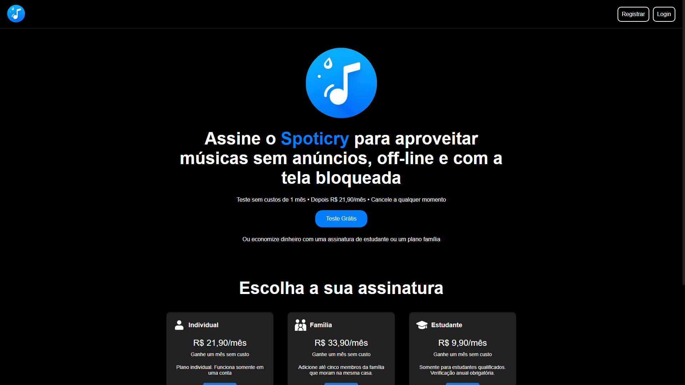
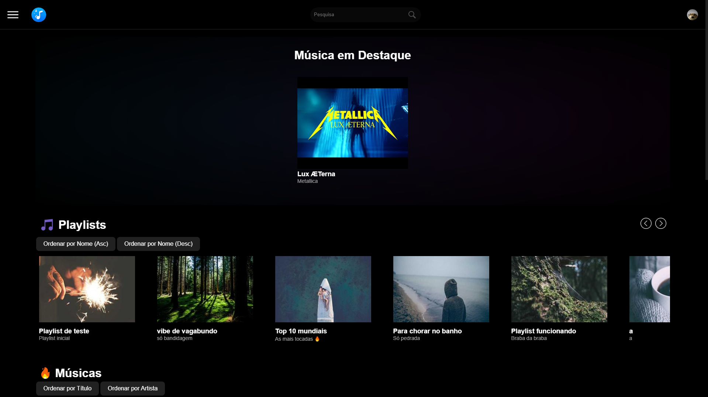
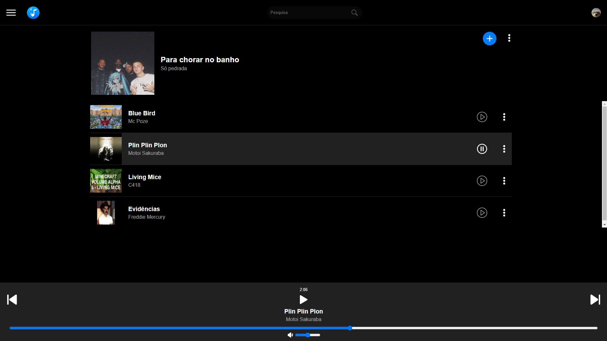

<h1 align="center">Spoticry</h1>

---

## 💡 Sobre o Projeto

Este projeto é uma aplicação web que permite gerenciar musicas e playlists e reproduzi-las:

- **Home**: Página inicial, escolha seu plano ou logue e sua conta.
<p align="center">
  
</p>
<br><br>

- **Feed**: Exibe seu feed com todas as playlists e músicas.
<p align="center">
  
</p>
<br><br>

- **Playlist**: Edite ou reproduza sua playlist.
<p align="center">
  
</p>
<br><br>


## 🚀 Como Executar o Projeto
Siga os passos abaixo para executar o projeto em seu ambiente local:
   
1. **Clone o repositório**
   ```bash
   git clone https://github.com/Victordplima/Spoticry.git
   ```
   
2. **Navegue até os arquivos**
   ```bash
   cd Spoticry
   ```

3. **Instalação de Dependências**
   ```bash
   npm install
   ```

4. **Inicialização da Aplicação**
   ```bash
   npm start
   ```

## 👨‍💻 Autores
- [Victor Dala](https://github.com/Victordplima)
- [Sávio Carlos](https://github.com/SavioCarlos)
